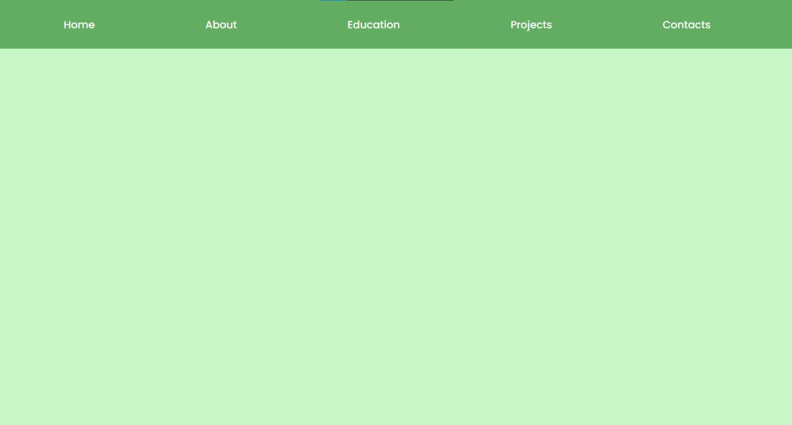
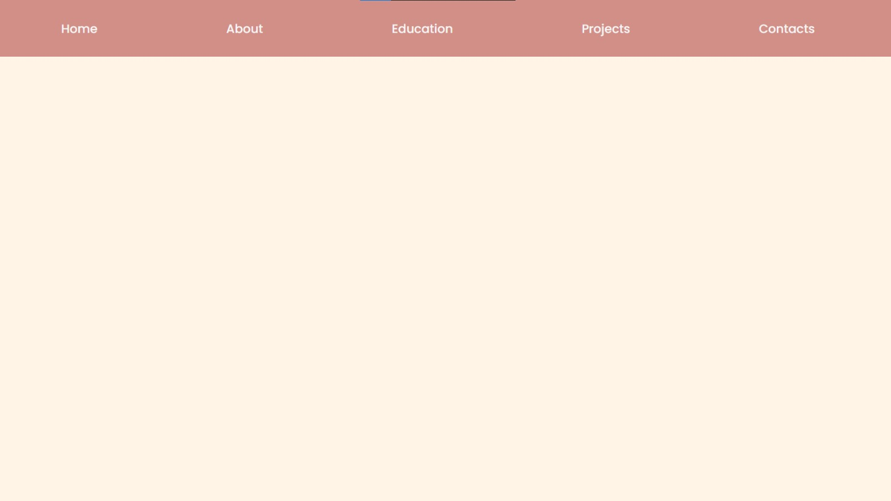

# Navigation Bar and Multi-Color Website  

A simple website featuring a **navigation bar** and a **multi-color theme** created using **CSS variables**. This project is designed to demonstrate the use of modern CSS techniques for creating dynamic and visually appealing websites.

## Preview




## Features  

- **Responsive Navigation Bar**: A clean and user-friendly navigation bar.  
- **Multi-Color Theme**: Use of CSS variables for easy and flexible color customization.  
- **Modern Design**: Emphasis on simplicity and elegance in UI design.  

## Technologies Used  

- **HTML5**  
- **CSS3 (including CSS variables)**  

## File Structure 

```plaintext
|-- index.html          # Main entry point for the website
|-- style.css           # CSS file containing styles and CSS variables
|-- readme.md           # This README file
|-- assets/             # Folder for additional files
    |-- home.html       # Home page content
    |-- about.html      # About page content
    |-- education.html  # Education page content
    |-- projects.html   # Projects page content
    |-- contacts.html   # Contact page content
    |-- Sample1.png     # Sample image 1
    |-- Sample2.png     # Sample image 2
```

## Demo

Preview the website by visiting: [Preview](GitHub Pages Link) 

## Installation

### 1. Clone the repository:
```bash
git clone https://github.com/Harshanandita/Multi-Color-Website.git
```

### 2. Open the `index.html` file in your browser to view the website.

## How to Customize

### Changing Colors

To change the website's color theme, modify the CSS variables in the `:root` selector inside the `style.css` file:
```css
:root {
  --primary-color: rgba(165, 42, 42, 0.5); /* Main color */
  --secondary-color: rgba(255, 235, 205, 0.5); /* Accent color */
  --text-color: whitesmoke; /* Text color */
}
```

### Adding Navigation Items

To add more links to the navigation bar, edit the `<nav>` section in `index.html`:
```html
<nav>
    <ul>
        <li><a href="assets/home.html">Home</a></li>
        <li><a href="assets/about.html">About</a></li>
        <li><a href="assets/education.html">Education</a></li>
        <li><a href="assets/project.html">Projects</a></li>
        <li><a href="assets/contact.html">Contacts</a></li>
    </ul>
</nav>	
```

## License

This project is licensed under the [MIT License](abcd).

## Contributing

Contributions are welcome! Feel free to open an issue or submit a pull request.

## Contact

For questions or suggestions, reach out via:

- Email: singh01ha@gmail.com
- GitHub: Harshanandita